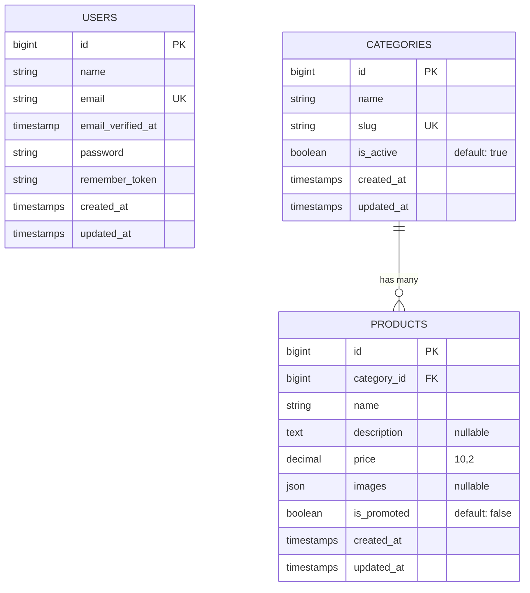

# 👟 Abraão Calçados — Catálogo Digital

> Catálogo digital de calçados com painel administrativo, integração com WhatsApp e frontend moderno. Desenvolvido com **Laravel 13**, **Filament 5**, **Livewire** e **Tailwind CSS**.

---

## 📋 Índice

- [Visão Geral](#-visão-geral)
- [Stack Tecnológica](#-stack-tecnológica)
- [Arquitetura do Projeto](#-arquitetura-do-projeto)
- [Modelos e Banco de Dados](#-modelos-e-banco-de-dados)
- [Painel Administrativo (Filament)](#-painel-administrativo-filament)
- [Frontend — Catálogo Público](#-frontend--catálogo-público)
- [Serviços](#-serviços)
- [Configuração da Loja](#-configuração-da-loja)
- [Testes](#-testes)
- [Instalação e Setup](#-instalação-e-setup)
- [Deploy](#-deploy)
- [Estrutura de Diretórios](#-estrutura-de-diretórios)

---

## 🎯 Visão Geral

O **Abraão Calçados** é um catálogo digital para uma loja de calçados localizada em **Estr. Juarez Távora, 206 — Alto Alegre**. O sistema permite:

- **Catálogo público** — Exibe produtos em promoção com filtro por categoria, preço formatado em BRL e botão "Eu quero!" que redireciona para o WhatsApp com mensagem pré-montada. Suporta galeria de imagens por produto.
- **Painel administrativo** — Gerenciamento completo de categorias, produtos e usuários via Filament, incluindo upload de múltiplas imagens com reordenação, toggle de promoção e filtros avançados.
- **Seção "Como Chegar"** — Mapa embutido do Google Maps com botão de direções.
- **Design responsivo** — Layout mobile-first com glassmorphism, micro-animações e paleta de cores customizada (brand).

---

## 🛠 Stack Tecnológica

| Camada         | Tecnologia                         | Versão    |
|----------------|------------------------------------|-----------|
| **Framework**  | Laravel                            | 13.x      |
| **PHP**        | PHP                                | ≥ 8.3     |
| **Admin Panel**| Filament                           | 5.4+      |
| **Reatividade**| Livewire                           | (via Filament) |
| **CSS**        | Tailwind CSS (CDN no frontend)     | 4.x (Vite plugin) |
| **Banco**      | MySQL / SQLite                     | —         |
| **Build**      | Vite                               | 8.x       |
| **Testes**     | Pest PHP                           | 4.x       |
| **Container**  | Docker via Laravel Sail            | —         |

### Dependências Principais

**PHP (composer.json):**
- `filament/filament` — Painel admin completo e modular
- `laravel/framework` — Core do framework (^13.0)
- `laravel/tinker` — REPL interativo

**JS (package.json):**
- `@tailwindcss/vite` + `tailwindcss` — Compilação de CSS
- `laravel-vite-plugin` — Integração Laravel + Vite
- `concurrently` — Execução paralela (server, queue, logs, vite)

---

## 🏗 Arquitetura do Projeto

```
┌─────────────────────────────────────────────┐
│                  FRONTEND                    │
│  welcome-catalog.blade.php                  │
│    └── <x-layouts.catalog>                  │
│         └── <livewire:show-catalog />       │
│              ├── <x-catalog.header />       │
│              ├── <x-catalog.category-filter>│
│              ├── <x-catalog.product-card>   │
│              │    └── <x-catalog.whatsapp-button>
│              ├── <x-catalog.empty-state />  │
│              ├── <x-catalog.location />     │
│              └── <x-catalog.footer />       │
├─────────────────────────────────────────────┤
│               BACKEND / API                  │
│  Livewire: ShowCatalog / ShowProduct        │
│    ├── Product::promoted()->with('category')│
│    └── WhatsAppUrlGenerator::generateFrom() │
├─────────────────────────────────────────────┤
│           ADMIN (Filament /admin)           │
│  ├── UserResource (CRUD)                    │
│  ├── CategoryResource (CRUD)                │
│  └── ProductResource (Modular CRUD)         │
├─────────────────────────────────────────────┤
│              BANCO DE DADOS                  │
│  ├── users                                  │
│  ├── categories (name, slug, is_active)     │
│  └── products (name, price, images, promo)  │
└─────────────────────────────────────────────┘
```

### Fluxo de Dados

1. O usuário acessa `/` → rota renderiza `welcome-catalog.blade.php`
2. O layout `x-layouts.catalog` carrega Tailwind CDN, fontes Inter e Livewire
3. O componente `ShowCatalog` busca produtos promovidos com eager-loading de categorias
4. Ao clicar em um produto, a rota `/produto/{slug}` renderiza os detalhes com galeria de imagens
5. O componente `ShowProduct` gerencia a visualização do produto e produtos relacionados
6. Para cada produto, gera a URL do WhatsApp via `WhatsAppUrlGenerator`
7. Os componentes Blade renderizam header, filtros, cards, mapa e footer
8. Ao clicar em "Eu quero!", abre o WhatsApp com mensagem pré-formatada

---

## 💾 Modelos e Banco de Dados

### Diagrama ER



### Model: `Category` (`app/Models/Category.php`)

| Campo       | Tipo      | Descrição                               |
|-------------|-----------|------------------------------------------|
| `name`      | string    | Nome da categoria                        |
| `slug`      | string    | Slug auto-gerado a partir do nome        |
| `is_active` | boolean   | Se a categoria está visível no catálogo  |

**Comportamentos:**
- **Auto-slug:** Gera slug automaticamente no evento `creating`. No `updating`, atualiza o slug se o nome foi modificado.
- **Scope `active`:** Filtra categorias ativas (`is_active = true`)
- **Relacionamento:** `hasMany(Product::class)`
- **Factory:** Gera nome com 2 palavras faker + slug

### Model: `Product` (`app/Models/Product.php`)

| Campo         | Tipo        | Descrição                              |
|---------------|-------------|------------------------------------------|
| `category_id` | FK          | Referência à categoria (cascade delete) |
| `name`        | string      | Nome do produto                          |
| `description` | text (null) | Descrição detalhada                      |
| `price`       | decimal(10,2) | Preço em reais                        |
| `images`      | array (json)| Lista de caminhos das imagens          |
| `is_promoted` | boolean     | Se o produto aparece no catálogo público |

**Comportamentos:**
- **Accessor `formatted_price`:** Retorna o preço formatado como moeda brasileira (`R$ 199,90`) via `Number::currency()`
- **Scope `promoted`:** Filtra produtos em promoção (`is_promoted = true`)
- **Relacionamento:** `belongsTo(Category::class)`
- **Cast `images`:** Converte automaticamente JSON em array PHP.

### Model: `User` (`app/Models/User.php`)

- Implementa `FilamentUser` para acesso ao painel admin
- `canAccessPanel()` retorna `true` para todos os usuários autenticados
- Usa atributos PHP 8 (`#[Fillable]`, `#[Hidden]`)

---

## 🛡 Painel Administrativo (Filament)

Acessível em `/admin` com autenticação obrigatória.

### Estrutura Modular
O projeto utiliza uma arquitetura modular para os Resources do Filament, separando:
- **Schemas:** Definição dos campos do formulário (ex: `ProductForm`)
- **Tables:** Configuração das colunas e filtros da listagem (ex: `ProductsTable`)
- **Pages:** Definição das páginas de CRUD (List, Create, Edit)

### ProductResource
**Namespace:** `App\Filament\Resources\Products\ProductResource`

#### Formulário (`Products/Schemas/ProductForm`)
- Suporte a múltiplas imagens com arraste para reordenar.
- Upload automático para o diretório `products/` no disco `public`.
- Toggle intuitivo para promoção e integração com categorias.

#### Tabela (`Products/Tables/ProductsTable`)
- Coluna de imagens em formato **stacked** (pilha).
- Filtros por categoria e status de promoção.
- Toggle direto na tabela para ativar/desativar promoção.

---

## 🌐 Frontend — Catálogo Público

### Componente Livewire: `ShowProduct`
Gerencia a página de detalhes de um produto individual:
- **Galeria Interativa:** Desenvolvida com Alpine.js para troca de imagens sem refresh.
- **Cálculo de Preços:** Exibe preço via PIX (5% off) e parcelamento (3x sem juros).
- **Produtos Relacionados:** Sugere outros itens da mesma categoria.
- **SEO Dinâmico:** Tags Open Graph geradas individualmente para cada produto.

---

## ⚙️ Serviços

### `WhatsAppUrlGenerator` (`app/Services/WhatsAppUrlGenerator.php`)

Gera URLs para a API do WhatsApp com mensagem pré-formatada.

```php
WhatsAppUrlGenerator::generate('Tênis Nike Air', 'R$ 299,90');
// → https://wa.me/5568992607794?text=Ol%C3%A1!%20Gostaria%20de%20saber%20mais...

WhatsAppUrlGenerator::generateFromProduct($product);
// → Usa $product->name e $product->formatted_price
```

**Formato da mensagem:**
> Olá! Gostaria de saber mais sobre o produto {nome} no valor de {preço}.

---

## 🔧 Configuração da Loja

Arquivo: `config/store.php` — Todas as variáveis vêm do `.env`:

| Variável `.env`       | Config Key              | Descrição                    | Valor Default          |
|-----------------------|-------------------------|------------------------------|------------------------|
| `STORE_NAME`          | `store.name`            | Nome da loja                 | Abraão Calçados        |
| `STORE_ADDRESS`       | `store.address`         | Endereço físico              | (vazio)                |
| `STORE_DESCRIPTION`   | `store.description`     | Descrição/tagline            | (vazio)                |
| `STORE_PHONE`         | `store.phone`           | Telefone de contato          | (vazio)                |
| `WHATSAPP_NUMBER`     | `store.whatsapp_number` | Número WhatsApp (com DDI)    | (vazio)                |

Valores atuais no `.env`:
```env
STORE_NAME="Abraão Calçados"
STORE_ADDRESS="Estr. Juarez Távora, 206 - Alto Alegre"
STORE_DESCRIPTION="As melhores promoções da semana em calçados!"
STORE_PHONE="(68)99260-7794"
WHATSAPP_NUMBER=5568992607794
```

---

## 🧪 Testes

O projeto usa **Pest PHP 4** com os seguintes test suites:

### Testes Unitários (`tests/Unit/`)

| Arquivo                              | O que testa                                        |
|--------------------------------------|----------------------------------------------------|
| `Models/CategoryTest.php`            | Relacionamento hasMany, auto-slug, scope active    |
| `Models/ProductTest.php`             | Relacionamento belongsTo, scope promoted, formatted_price |
| `Services/WhatsAppUrlGeneratorTest.php` | Geração de URL, encoding de caracteres especiais |

### Testes de Feature (`tests/Feature/`)

| Arquivo                                   | O que testa                                         |
|-------------------------------------------|-----------------------------------------------------|
| `Http/CatalogPageTest.php`                | Status 200 na homepage, exibição do nome da loja    |
| `Livewire/ShowCatalogTest.php`            | 7 cenários: render, filtro por categoria, promoção, preço formatado, link WhatsApp |
| `Admin/CategoryResourceTest.php`          | CRUD completo: list, create, edit, delete, auto-slug, validação |
| `Admin/ProductResourceTest.php`           | CRUD completo: list, create, edit, toggle promoção, validação |

### Executar os testes

```bash
# Via Sail (dentro do container)
./vendor/bin/sail artisan test

# Diretamente
php artisan test

# Ou via Pest
./vendor/bin/pest
```

### Configuração de Testes (`phpunit.xml`)

- Banco de dados: `testing` (separado)
- Cache: `array`
- Queue: `sync`
- Session: `array`
- Mail: `array`

---

## 🚀 Instalação e Setup

### Pré-requisitos

- PHP ≥ 8.3
- Composer
- Node.js + npm
- Docker + Docker Compose (recomendado via Sail)

### Setup com Docker (Laravel Sail)

```bash
# 1. Clonar o repositório
git clone <repo-url> abraao-calcados
cd abraao-calcados

# 2. Copiar .env
cp .env.example .env

# 3. Instalar dependências PHP
composer install

# 4. Subir os containers (MySQL + App)
./vendor/bin/sail up -d

# 5. Gerar chave da aplicação
./vendor/bin/sail artisan key:generate

# 6. Rodar migrations e seeders
./vendor/bin/sail artisan migrate:fresh --seed

# 7. Criar symlink do storage
./vendor/bin/sail artisan storage:link

# 8. Instalar dependências JS e compilar
npm install
npm run build
```

### Setup sem Docker

```bash
# Certifique-se de ter MySQL rodando e ajuste o .env
composer install
php artisan key:generate
php artisan migrate:fresh --seed
php artisan storage:link
npm install
npm run build
```

### Modo Desenvolvimento

```bash
# Inicia server, queue, logs e vite em paralelo
composer dev
```

Isso executa simultaneamente:
- `php artisan serve` — Servidor HTTP
- `php artisan queue:listen` — Processamento de filas
- `php artisan pail` — Log viewer em tempo real
- `npm run dev` — Vite dev server

### Seeders

O `DatabaseSeeder` executa:

1. **Usuário admin:** `admin@abraao.com` / `password`
2. **CategorySeeder:** 5 categorias — Tênis, Sandálias, Sapatos Sociais, Chinelos, Botas
3. **ProductSeeder:** 15 produtos (3 por categoria), todos marcados como promoção

> ⚠️ **Imagens do Seeder:** O ProductSeeder espera imagens PNG em `database/seeders/images/` com nomes como `tenis_01.png`, `sandalia_02.png`, etc. Se a pasta estiver vazia, os produtos serão criados sem imagem (exibindo placeholder no catálogo).

#### Lista de imagens esperadas:
```
database/seeders/images/
├── tenis_01.png
├── tenis_02.png
├── tenis_03.png
├── sandalia_01.png
├── sandalia_02.png
├── sandalia_03.png
├── sapato_social_01.png
├── sapato_social_02.png
├── sapato_social_03.png
├── chinelo_01.png
├── chinelo_02.png
├── chinelo_03.png
├── bota_01.png
├── bota_02.png
└── bota_03.png
```

---

## 📦 Deploy

O projeto inclui um script de deploy em `deploy.sh` para servidores com Nginx + PHP-FPM:

```bash
chmod +x deploy.sh
./deploy.sh
```

O script realiza:
1. `git pull origin main`
2. `composer install --no-dev --optimize-autoloader`
3. `npm install && npm run build`
4. `php artisan migrate --force`
5. `php artisan storage:link`
6. Cache optimization (config, routes, views, icons)
7. Restart do PHP-FPM

---

## 📁 Estrutura de Diretórios

```
abraao-calcados/
├── app/
│   ├── Filament/
│   │   └── Resources/
│   │       ├── CategoryResource.php          # Filament CRUD — Categorias
│   │       ├── ProductResource.php           
│   │       ├── Categories/
│   │       │   ├── Pages/                    # List, Create, Edit
│   │       │   ├── Schemas/CategoryForm.php  # Formulário alternativo
│   │       │   └── Tables/CategoriesTable.php# Tabela alternativa
│   │       └── Products/
│   │           ├── ProductResource.php       # ✅ Resource real
│   │           ├── Pages/                    # List, Create, Edit
│   │           ├── Schemas/ProductForm.php   # Formulário dos produtos
│   │           └── Tables/ProductsTable.php  # Tabela dos produtos
│   ├── Http/Controllers/
│   │   └── Controller.php                    # Base controller (vazio)
│   ├── Livewire/
│   │   └── ShowCatalog.php                   # Componente do catálogo
│   ├── Models/
│   │   ├── Category.php                      # Model com auto-slug
│   │   ├── Product.php                       # Model com formatted_price
│   │   └── User.php                          # Model com FilamentUser
│   ├── Providers/
│   │   ├── AppServiceProvider.php
│   │   └── Filament/
│   │       └── AdminPanelProvider.php        # Config do painel admin
│   └── Services/
│       └── WhatsAppUrlGenerator.php          # Gerador de links WhatsApp
├── config/
│   └── store.php                             # Config da loja
├── database/
│   ├── factories/                            # CategoryFactory, ProductFactory, UserFactory
│   ├── migrations/                           # users, cache, jobs, categories, products
│   └── seeders/
│       ├── DatabaseSeeder.php                # Orchestrador
│       ├── CategorySeeder.php                # 5 categorias
│       ├── ProductSeeder.php                 # 15 produtos com imagens
│       └── images/                           # Imagens para seed (PNG)
├── public/
│   └── imagens/
│       └── logo.svg                          # Logo da loja
├── resources/
│   ├── css/app.css                           # Tailwind imports
│   ├── js/app.js                             # Entry point JS
│   └── views/
│       ├── welcome-catalog.blade.php         # Página principal
│       ├── components/
│       │   ├── layouts/catalog.blade.php     # Layout base
│       │   └── catalog/
│       │       ├── header.blade.php
│       │       ├── category-filter.blade.php
│       │       ├── product-card.blade.php
│       │       ├── whatsapp-button.blade.php
│       │       ├── empty-state.blade.php
│       │       ├── location.blade.php
│       │       └── footer.blade.php
│       └── livewire/
│           └── show-catalog.blade.php        # View do Livewire
├── routes/
│   └── web.php                               # Rota única: GET /
├── tests/
│   ├── Feature/
│   │   ├── Admin/                            # Testes do Filament
│   │   ├── Http/                             # Teste da página
│   │   └── Livewire/                         # Teste do componente
│   └── Unit/
│       ├── Models/                           # Testes dos models
│       └── Services/                         # Teste do WhatsApp service
├── compose.yaml                              # Docker: Sail + MySQL
├── deploy.sh                                 # Script de deploy
├── vite.config.js                            # Vite + Tailwind + Laravel plugin
└── phpunit.xml                               # Config de testes
```

---

## 🐛 Problemas Conhecidos

1. **Arquivo depreciado:** `app/Filament/Resources/ProductResource.php` deve ser deletado manualmente:
   ```bash
   rm app/Filament/Resources/ProductResource.php
   ```

2. **Arquivo não utilizado:** `resources/views/welcome.blade.php` pode ser removido:
   ```bash
   rm resources/views/welcome.blade.php
   ```

3. **Imagens do seeder:** A pasta `database/seeders/images/` contém apenas um `.gitkeep`. Para popular o catálogo com imagens, adicione os 15 arquivos PNG listados na seção de [Seeders](#seeders).

4. **Layout duplo:** O `CategoryResource` principal define seu form inline (com auto-slug via `afterStateUpdated`), mas também existe `Categories/Schemas/CategoryForm.php` que não é usado. Considere unificar.

---

## 📝 Acesso ao Painel Admin

Após rodar os seeders:

- **URL:** `http://localhost/admin`
- **Email:** `admin@abraao.com`
- **Senha:** `password`
